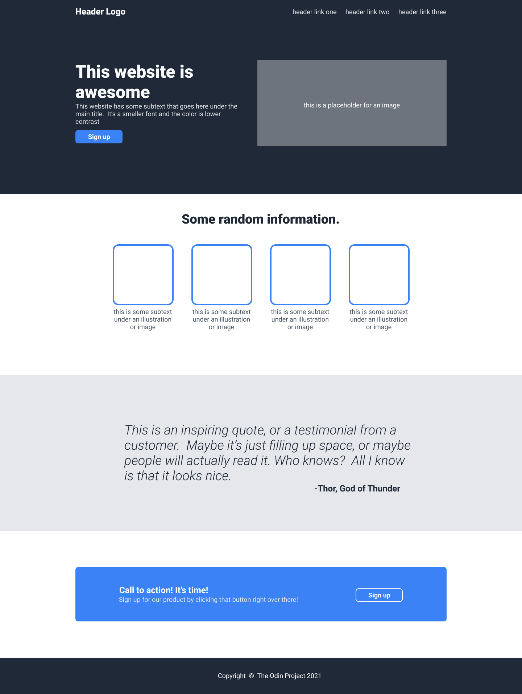

Odin Project: Responsive Website with Flexbox

Objective
This project aimed to learn and apply Flexbox concepts to build a responsive website. The layout was inspired by the image provided in the link, focusing on ensuring a flexible and modern structure for the site using best CSS practices.

Learning
Gained understanding and practical experience with the Flexbox layout model. Improved CSS skills and interface design.

